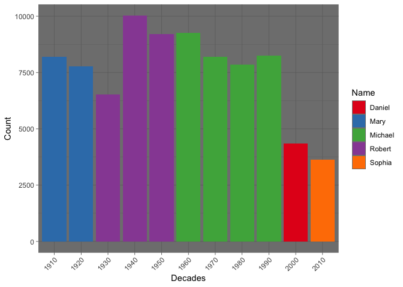
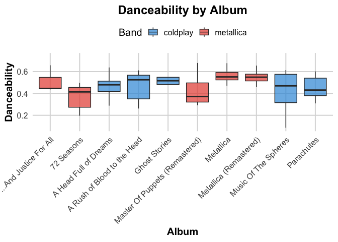
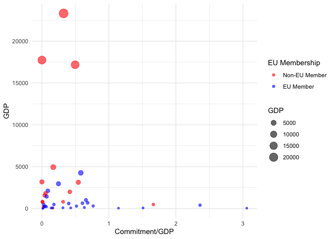
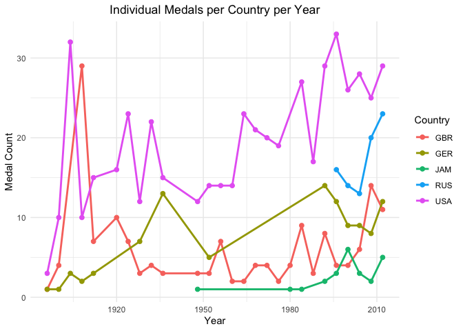

# Purpose

This README will be my main document where I will explain my thinking
process for answering all the questions. I have put all my questions in
the solutions folder and will call on them where necessary.

``` r
rm(list = ls()) # Clean your environment:
gc() # garbage collection - It can be useful to call gc after a large object has been removed, as this may prompt R to return memory to the operating system.
```

    ##          used (Mb) gc trigger (Mb) limit (Mb) max used (Mb)
    ## Ncells 472600 25.3    1015595 54.3         NA   669380 35.8
    ## Vcells 884398  6.8    8388608 64.0      16384  1851900 14.2

``` r
library(tidyverse)
```

    ## ── Attaching core tidyverse packages ──────────────────────── tidyverse 2.0.0 ──
    ## ✔ dplyr     1.1.4     ✔ readr     2.1.5
    ## ✔ forcats   1.0.0     ✔ stringr   1.5.1
    ## ✔ ggplot2   3.4.4     ✔ tibble    3.2.1
    ## ✔ lubridate 1.9.2     ✔ tidyr     1.3.1
    ## ✔ purrr     1.0.2     
    ## ── Conflicts ────────────────────────────────────────── tidyverse_conflicts() ──
    ## ✖ dplyr::filter() masks stats::filter()
    ## ✖ dplyr::lag()    masks stats::lag()
    ## ℹ Use the conflicted package (<http://conflicted.r-lib.org/>) to force all conflicts to become errors

``` r
list.files('code/', full.names = T, recursive = T) %>% .[grepl('.R', .)] %>% as.list() %>% walk(~source(.))
```

The first lines of code (which I comment out) are how I set up the
folders using fmxdat and Texevier.

``` r
# #Create project
# 
# fmxdat::make_project(Mac=T,Open=T)
# 
# CHOSEN_LOCATION <- "/Users/ramzankamoto/Documents/Masters/DS_EXAM/23550716"
# 
# Texevier::create_template(directory = glue::glue("{CHOSEN_LOCATION}/"), template_name = "Question1")
# Texevier::create_template(directory = glue::glue("{CHOSEN_LOCATION}/"), template_name = "Question2")
# Texevier::create_template(directory = glue::glue("{CHOSEN_LOCATION}/"), template_name = "Question3")
# Texevier::create_template(directory = glue::glue("{CHOSEN_LOCATION}/"), template_name = "Question4")
```

### Question 1

### Loading Data

``` r
list.files('/Users/ramzankamoto/Documents/Masters/DS_EXAM/23550716/Question1/code', full.names = T, recursive = T) %>% as.list() %>% walk(~source(.))
list.files('/Users/ramzankamoto/Documents/Masters/DS_EXAM/23550716/Question2/code', full.names = T, recursive = T) %>% as.list() %>% walk(~source(.))
list.files('/Users/ramzankamoto/Documents/Masters/DS_EXAM/23550716/Question3/code', full.names = T, recursive = T) %>% as.list() %>% walk(~source(.))
list.files('/Users/ramzankamoto/Documents/Masters/DS_EXAM/23550716/Question4/code', full.names = T, recursive = T) %>% as.list() %>% walk(~source(.))
```

``` r
custom_names <- c("Baby_Names", "charts", "population_data","HBO_credits","HBO_titles")

read_rds_files("/Users/ramzankamoto/Documents/Masters/DS_EXAM/23550716/Question1/data", custom_names)
```

### First Plot

To get a feel of the data I try to find the names that have the highest
count per decade. Ideally in the wrangle I should have made this
cummulative to get true values. Nonetheless here is the first plot.

``` r
#use highest count function to find the name with the highest count per decade
highest_count_table <- highest_count_per_decade(data_frame = Baby_Names)

Names_per_decade_plot <- plot_highest_names(highest_count_table)

print(Names_per_decade_plot)
```



### Spearmans rank correlation

For the next part I try to conduct the Spearmans rank correlation. I
took the top 25 boy and girl names for the years 1995 and 1998 to see
whether there is some naming persistence and to either confirm or deny
claims that naming persistence died off in the 90s.

``` r
#creating a dataframes for top 25 names in 1995 and 1998
top_names <- create_top_names_datasets(Baby_Names)
top_25_males_1995 <- top_names$males_1995
top_25_females_1995 <- top_names$females_1995
top_25_males_1998 <- top_names$males_1998
top_25_females_1998 <- top_names$females_1998
```

After collecting all the data frames, I performed the Spearmans
correlation.

``` r
cor.test(top_25_males_1995$Count, top_25_females_1995$Count, method = "spearman")
```

    ## 
    ##  Spearman's rank correlation rho
    ## 
    ## data:  top_25_males_1995$Count and top_25_females_1995$Count
    ## S = 0, p-value = 3.196e-07
    ## alternative hypothesis: true rho is not equal to 0
    ## sample estimates:
    ## rho 
    ##   1

``` r
cor.test(top_25_males_1998$Count, top_25_females_1998$Count, method = "spearman")
```

    ## 
    ##  Spearman's rank correlation rho
    ## 
    ## data:  top_25_males_1998$Count and top_25_females_1998$Count
    ## S = 0, p-value = 3.196e-07
    ## alternative hypothesis: true rho is not equal to 0
    ## sample estimates:
    ## rho 
    ##   1

The correlation appears to have been unsuccesful given that we got a
perfect score of one both in 1998 and 1995. However, just by eyeballing
it, names such as Michael certainly remained popular 3 years on.

### Question 2

### Data

I struggled to adapt my read_rds function to also load csv files. For
this reason, I use the function as far as possible and beyond that I
used the generic read.csv function from R.

``` r
#load in rds files 
read_rds_files("/Users/ramzankamoto/Documents/Masters/DS_EXAM/23550716/Question2/data/cold_v_met_rds", c("spotify", "billboard_100"))

#"manually" load in csv files
coldplay <- read.csv("/Users/ramzankamoto/Documents/Masters/DS_EXAM/23550716/Question2/data/Coldplay_vs_Metallica_csv/Coldplay.csv")
metallica <- read.csv("/Users/ramzankamoto/Documents/Masters/DS_EXAM/23550716/Question2/data/Coldplay_vs_Metallica_csv/metallica.csv")
```

### Data cleaning

For this question I want to find the top 5 albums of both metallica and
coldplay by popularity. I then take these ten albums and compare their
danceability directly using boxplots.

I want to append the Metallica and coldplay datasets. For coldplay the
column name for album is album_name so I made this consitent first so
that I could apply a function to that gives me the top 5 albums by both
bands.

``` r
#rename album column 
coldplay1 <- coldplay %>% 
    rename(album = album_name)
```

New dataframes and bind the rows.

``` r
#select the variables that we will need to conduct some analysis 
metallica_top_albums <- get_top_5_albums_song(metallica) %>% 
    select(name, album, popularity, danceability)

metallica_top_albums$band <- "metallica"

coldplay_top_albums <- get_top_5_albums_song(coldplay1) %>% 
    select(name, album, popularity, danceability)

#Create a column that has all its values as the band name 
coldplay_top_albums$band <- "coldplay"

#bind the two data frames ready for plotting 
top_albums <- bind_rows(metallica_top_albums, coldplay_top_albums)
```

### Plot

Call function to plot danceability of top albums.

``` r
danceability_plot <- create_danceability_boxplot(top_albums)
```



The two bands seem to be very comparable in terms of danceability. Most
songs for both bands appear to be approximately 0.6, which when you
consider these are their most popular albums may seem quite low. There
are likely other factors that make these bands enjoyable which I do not
explore here.

### Question 3

### Data

Again here with the csv’s I simply hard code my data in.

``` r
alloc <- read_csv("/Users/ramzankamoto/Documents/Masters/DS_EXAM/23550716/Question3/data/Ukraine_Aid/Financial Allocations.csv")
```

    ## Rows: 41 Columns: 7
    ## ── Column specification ────────────────────────────────────────────────────────
    ## Delimiter: ","
    ## chr (1): Country
    ## dbl (6): EU member, Financial allocations($ billion), Humanitarian allocatio...
    ## 
    ## ℹ Use `spec()` to retrieve the full column specification for this data.
    ## ℹ Specify the column types or set `show_col_types = FALSE` to quiet this message.

``` r
commit <- read_csv("/Users/ramzankamoto/Documents/Masters/DS_EXAM/23550716/Question3/data/Ukraine_Aid/Financial Commitments.csv")
```

    ## Rows: 42 Columns: 11
    ## ── Column specification ────────────────────────────────────────────────────────
    ## Delimiter: ","
    ## chr  (1): Country
    ## dbl (10): EU member, GDP in 2021($ billion), Financial commitments($ billion...
    ## 
    ## ℹ Use `spec()` to retrieve the full column specification for this data.
    ## ℹ Specify the column types or set `show_col_types = FALSE` to quiet this message.

### Data cleaning

For this question I will compare EU countries with Rest of the World
(RoW) by creating a plot bubble plot that shows which countries have
allocated more resources as a percentage of GDP.

First create a new dataframe with our variables of interest.

``` r
new_commit <- commit %>% 
    select(Country,`EU member` ,`GDP in 2021($ billion)`,`Total bilateral commitments($ billion)`) %>% 
    mutate(commit_per_gdp = `Total bilateral commitments($ billion)`/`GDP in 2021($ billion)`*100)
```

Next I rename some columns so they are easier to work with.

``` r
commit_df <- new_commit %>% 
    rename(country = Country,
           eu_member =`EU member`,
           gdp = `GDP in 2021($ billion)`,
           commit_gdp = commit_per_gdp
           )
```

### Plot

Use bubble plot function to determine the percentage of GDP that
European Countries are committing to bilateral exchange with Ukraine.

``` r
plot_gdp_vs_commit(commit_df)
```



### Regression analysis

Next we run a simple regression to see how strong the effect that being
an EU member has on total bilateral allocation controlling for all other
variables. We start again by cleaning the data.

``` r
# Slightly messy but renames variables to be more usable.
alloc_df <- alloc %>% 
    rename(country = Country,
           eu_member = `EU member`,
           fin_alloc = `Financial allocations($ billion)`,
           humanitarian_alloc = `Humanitarian allocations($ billion)`,
           military_alloc = `Military allocations($ billion)`,
           total_bi_alloc = `Total bilateral allocations($ billion)`,
           share_eu_alloc = `Share in EU allocations($ billion)`) %>% 
    select(-country)
```

### Regression Output

``` r
ols_model1 <- lm_eu_effect(alloc_df, "total_bi_alloc", control_vars = c("fin_alloc","humanitarian_alloc","military_alloc"))

print(ols_model1)
```

    ## 
    ## Call:
    ## lm(formula = formula, data = data)
    ## 
    ## Residuals:
    ##        Min         1Q     Median         3Q        Max 
    ## -7.212e-10 -1.815e-10 -9.260e-11  5.560e-11  9.855e-10 
    ## 
    ## Coefficients:
    ##                      Estimate Std. Error    t value Pr(>|t|)    
    ## (Intercept)        -5.526e-11  1.006e-10 -5.490e-01   0.5863    
    ## eu_member           2.421e-10  1.206e-10  2.007e+00   0.0525 .  
    ## fin_alloc           1.000e+00  1.388e-11  7.203e+10   <2e-16 ***
    ## humanitarian_alloc  1.000e+00  1.186e-10  8.428e+09   <2e-16 ***
    ## military_alloc      1.000e+00  1.011e-11  9.891e+10   <2e-16 ***
    ## ---
    ## Signif. codes:  0 '***' 0.001 '**' 0.01 '*' 0.05 '.' 0.1 ' ' 1
    ## 
    ## Residual standard error: 3.425e-10 on 35 degrees of freedom
    ##   (1 observation deleted due to missingness)
    ## Multiple R-squared:      1,  Adjusted R-squared:      1 
    ## F-statistic: 1.265e+22 on 4 and 35 DF,  p-value: < 2.2e-16

### Question 4

For question 4, I started by trying to wrangle the data top see if I
could separate individual sports from team sports so that I award team
sports 1 medal instead of medal per athlete. I struggled with this a bit
but ended up at least with all individual events.

We can there compare some individual medal performance over time for a
number of countries and make some suggestions.

### Data

``` r
rds_data_list <- read_rds_files("/Users/ramzankamoto/Documents/Masters/DS_EXAM/23550716/Question4/data/olympics", custom_names = c("GDP","summer","winter"))
```

### Data frames

``` r
#creating a label which tells us whether a sport is individual or team 
s_games <- label_team_sports(summer)

#data to be used for the plot 
summer_plotdata <- s_games %>% filter(Label == "Individual", 
                                      Country == c("USA", "GER", "GBR","RUS", "JAM"))
```

## Plot

Here we create a plot that counts how many individual medals a country
earns at those summer games.

``` r
#first we aggregate the models so the data is usable 
s_plot_data <- aggregate_medals(summer_plotdata)

#apply a function that adds up the medal count per year 
aggregate_medals_summer <- aggregate_medal_counts(s_plot_data)

#Plot the line graph 
summer_plot <- plot_medal_counts(aggregate_medals_summer)
```

    ## Warning: Using `size` aesthetic for lines was deprecated in ggplot2 3.4.0.
    ## ℹ Please use `linewidth` instead.
    ## This warning is displayed once every 8 hours.
    ## Call `lifecycle::last_lifecycle_warnings()` to see where this warning was
    ## generated.

``` r
print(summer_plot)
```


